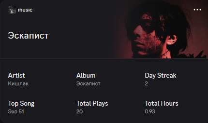
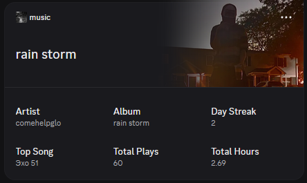

# Discord Dynamic Widgets (Spotify Sync)

<p float="left">
  
  
</p>

This script automatically syncs your currently playing Spotify track directly into Discord's new, undocumented **Widgets** system. It pulls metadata and album art from Spotify, manages the image assets on Discord's CDN, and updates your profile widget in real-time.

It also keeps a local SQLite database of your listening history to display stats like **Day Streak**, **Top Song**, **Total Plays**, and **Total Hours** directly on your profile.

## Features
-  **Real-time Spotify Sync**: Updates your Discord widget as soon as the song changes.
-  **Dynamic Album Art**: Uploads Spotify album covers directly to Discord's CDN as application assets.
-  **Listening Statistics**: Tracks your total plays, hours, day streak, and top songs using a local SQLite database (`music_history.db`).
-  **Fully Automated**: Runs in the background and polls Spotify seamlessly.

---

## Setup & Installation

### 1. Requirements
- Python 3.8+
- A Spotify account (Premium recommended, but works with free)
- A Discord account with the "Widgets" feature enabled (currently requires enabling Developer Experiments in Discord to see the UI).

### 2. Installation
Clone the repository and install the required packages:

```bash
git clone https://github.com/Yndaw2h/discord-widget-music-sync.git
cd discord-widget-music-sync
pip install -r requirements.txt
```

### 3. Environment Variables
Copy `.env.example` to a new file named `.env`:
```bash
# Mac/Linux
cp .env.example .env

# Windows
copy .env.example .env
```

Open `.env` and fill in the values:

#### Spotify API Setup
1. Go to the [Spotify Developer Dashboard](https://developer.spotify.com/dashboard/).
2. Create an App.
3. Add `https://open.spotify.com/` as a Redirect URI in the app settings.
4. Copy the **Client ID** and **Client Secret** to your `.env` file.


#### Discord Widgets Setup
*Disclaimer: Discord Widgets is an experimental feature. You need to enable Developer Experiments in your Discord client to access it.*

For a detailed video guide on how to enable Developer Experiments, I highly recommend this tutorial by **No Text To Speech**:
[](https://www.youtube.com/watch?v=gYv7D83u7yQ)

Alternatively, if you prefer a written guide:
[Full setup guide for enabling Developer Experiments and configuring your app](https://chloecinders.com/blog/discord-widgets#setting-up-your-application-and-developer-portal)

**Configuring the Widget in Developer Portal:**
When setting up the widget for your application in the **Discord Developer Portal**, you must map the schema exactly as follows so the script can inject the Spotify data correctly:

| Section | Design | Field | Presentation Type | Value Type |
| :--- | :--- | :--- | :--- | :--- |
| Widget Top | Hero | Image | — | Application Asset |
| Widget Top | Hero | Title | Text | Custom String |
| Widget Bottom | Stats Grid | Stat 1-6 Value | Text | Custom String |
| Widget Bottom | Stats Grid | Stat 1-6 Label | Text | Custom String |
| Add Widget Preview | Hero | Hero Image | — | Application Asset |

**Finding your Discord IDs and User Token:**
> [!CAUTION]
> **MASSIVE SECURITY WARNING:** Your User Token is the absolute master key to your entire Discord account. Do **NOT** share this with anyone, do **NOT** upload your `.env` file to GitHub, and do **NOT** show it on screen. If someone gets this token, they have full, unrestricted access to your account and can do whatever they want.

You can grab all three required Discord variables (`DISCORD_APPLICATION_ID`, `DISCORD_CONFIG_ID`, and `DISCORD_USER_TOKEN`) at the exact same time directly from the Developer Portal!
1. While still on the Developer Portal page where you configured the widget schema, open your browser's Developer Tools (usually `F12` or `Ctrl + Shift + I`) and go to the **Network** tab.
2. **BEFORE** clicking the button to save the widget, filter the Network tab for `/widget-configs`.
3. Hit the save button on the Developer Portal page.
4. Look for the `/widget-configs` request that pops up and click on it.
5. Under the **Headers** tab, look at the **Request URL**. The sequence of numbers right before `/widget-configs/` is your `DISCORD_APPLICATION_ID`, and the very last sequence of numbers at the end of the URL is your `DISCORD_CONFIG_ID`.
6. Scroll down to the **Request Headers** section and look for the `Authorization` header. That long value is your `DISCORD_USER_TOKEN`.
7. Copy all three values and paste them into your `.env` file.

#### Fallback Cover Image (Optional)
If you play a Local File or a song without an album cover, the script physically cannot update the Discord widget without an image because Discord's strict backend validation requires all schema fields to be satisfied. 
If you want the script to still update your stats when listening to songs with missing covers:
1. While still setting up your widget schema in the Developer Portal, click the button to add an asset directly on the **Widget Top > Content > Image** component.
2. Upload your fallback image (like a generic album cover or a transparent image) right there.
3. Once uploaded, grab the name of that newly uploaded image asset.
4. Add it to your `.env` file: `DEFAULT_COVER_ASSET=your_fallback_asset_name`

*If you leave this blank, the script will safely ignore songs with missing covers to prevent the API from crashing.*


### 4. Running the Script

Run the tracker:
```bash
python tracker.py
```
*Note: The first time you run this, a browser window will open asking you to log into Spotify and authorize the app.*

The script will now quietly run in the background, update your database, and push the newest track to your Discord Profile Widget!

###  Known Limitations
- **Aggressive Client Caching**: While the script successfully updates the widget on Discord's servers in real-time, the Discord desktop/web client heavily caches profile widgets. It is currently unknown exactly when the client decides to fetch the latest widget data naturally. To force the client to see the newest widget, you may need to reload the Discord client entirely (e.g., by pressing `Ctrl + R`).

---

## Disclaimer
This project uses undocumented Discord API endpoints (`/users/@me/widgets` and `/applications/{app_id}/assets`) and automates actions using a **user account token**, which falls under Discord's definition of "self-botting." This is against Discord's Terms of Service. Using this script puts your account at risk of action from Discord, up to and including termination. Discord may also change or remove these endpoints at any time without notice. Use at your own risk.
